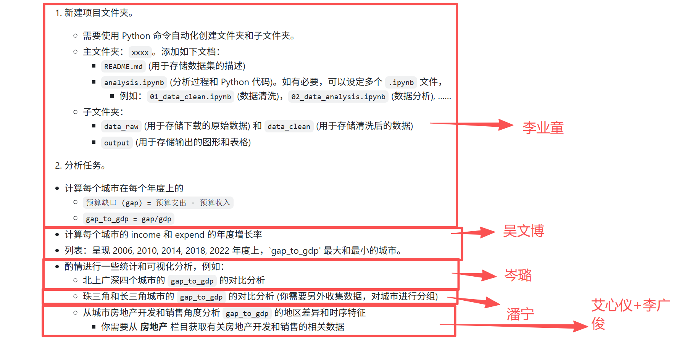

# 项目名称：中国主要城市财政预算缺口与房地产依赖度分析
## 👥 组队信息

- 队长：[李广俊·25210158]

- 队员：[李业童·25210163]、[吴文博·25210260]、[潘宁·25210220]、[艾心仪·25210109]、[岑璐·25210318]、

- 分工说明如下图所示：

    每个人负责的部分均有一个对应的 .ipynb 文件，命名方式为【序号_姓名首字母_负责部分】

## 📊 数据来源
    本项目的数据主要来源于 国家统计局（国家数据官网），包含以下原始数据文件：

- city_income.csv：城市一般公共预算收入数据。

- city_expenditure.csv：城市一般公共预算支出数据。

- gdp.csv：城市地区生产总值（GDP）数据。

- individual_deposit.csv：城市住户存款数据。

- china_urban_clusters.csv：中国城市群分类数据（包含长三角、粤港澳大湾区等划分）。

注：所有原始数据均存放在 data_raw 目录下，清洗后的整合数据将自动输出至 data_clean 和 output 目录。

## ⚙️ 代码运行原理与核心逻辑
本项目的代码（主要为 06_summary.ipynb）按以下逻辑依次执行：

1. 数据获取与清洗合并 (Data Cleaning & Merging)
- 读取解析：读取国家统计局下载的 CSV 文件，跳过无效表头，处理由于特殊字符导致的编码问题。

- 数据重塑：将原本的“宽表”转为“长表”（按城市和年份对齐），清洗掉带“注、说明”的冗余行，并统一提取年份数字。

- 数据合并：以“城市(city)”和“年份(year)”为键，将收入、支出、GDP、存款四张表进行外连接（Outer Merge），过滤空值后输出最终的干净数据集 merged_data.csv。

2. 财政缺口测算 (Fiscal Gap Calculation)
- 增长率分析：基于合并后的数据，按城市分组计算每年财政收入与支出的“同比增长率”。

- 核心指标构造：

- 财政缺口 (gap) = 预算支出 (expend) - 预算收入 (income)

- 财政缺口率 (gap_to_gdp) = 财政缺口 / 当年GDP

3. 区域对比分析：长三角 vs 珠三角 (Regional Comparison)
- 城市筛选：利用城市群字典文件，筛选出“长三角”和“珠三角（粤港澳大湾区）”的有效城市。

- 维度统计：分别计算两个城市群的“城市平均缺口率”和“总体规模缺口率”。

- 图表绘制：自动生成双子图折线图，直观展示 2006-2024 年两大经济带的财政缺口率演变趋势，并输出汇总统计表。

4. 房地产依赖度探讨 (Real Estate Dependency)
- 相关性计算：计算城市的“房地产销售额/GDP”、“开发投资额/GDP”等房地产指标与“财政缺口率(gap_to_gdp)”的相关系数。

- 北上广深特写：提取一线城市（北京、上海、广州、深圳）的宽表数据，生成财政缺口与房地产销售依赖度的对比折线图。

5. 结果导出 (Export)
    所有生成的清洗数据、汇总统计表格（.xlsx / .csv）以及可视化图表（.png）均会自动保存在 output 文件夹中。